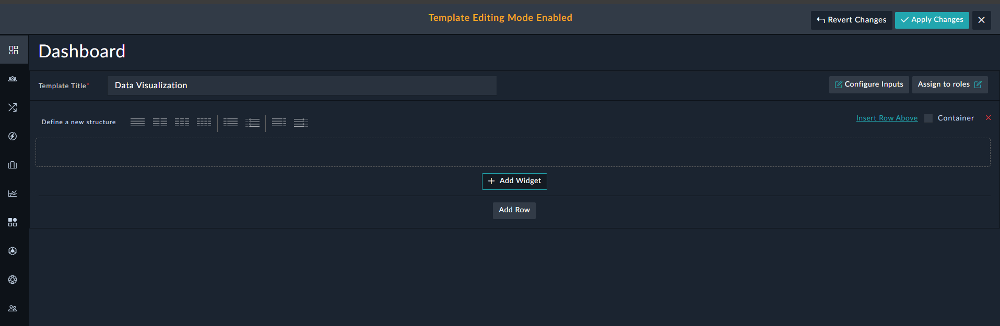
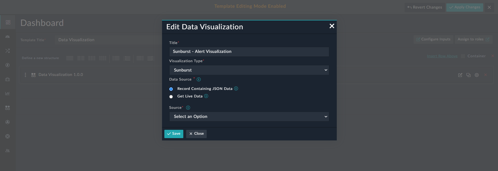
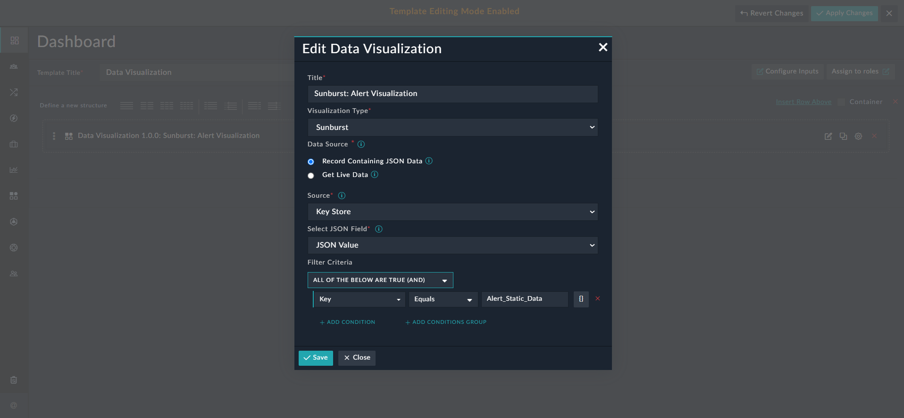
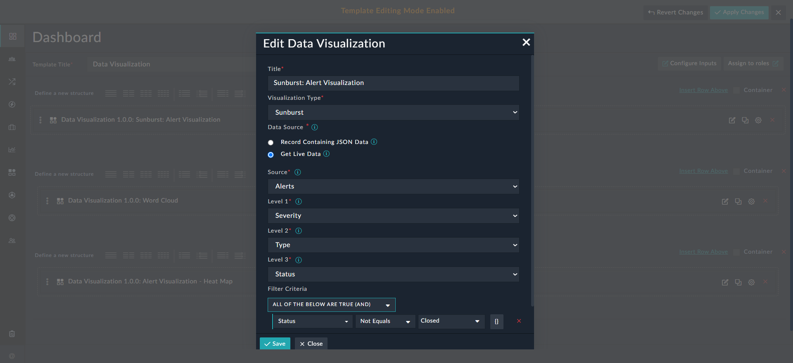
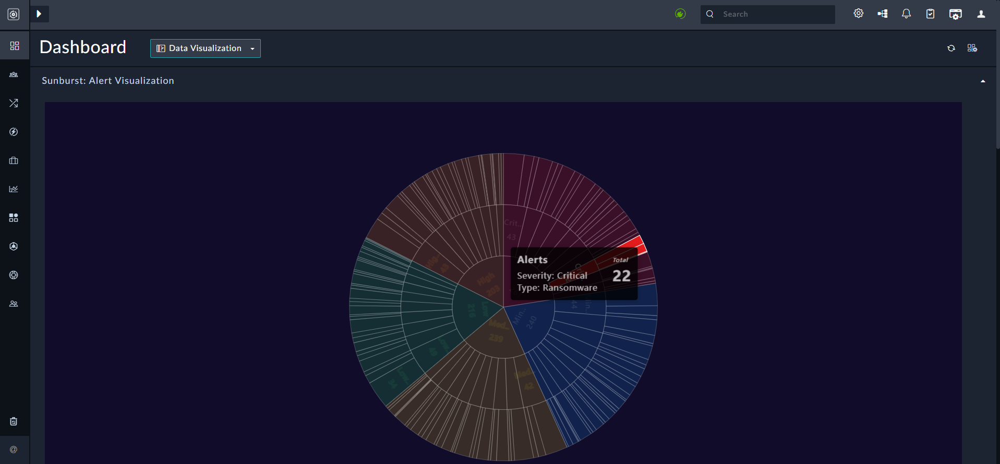
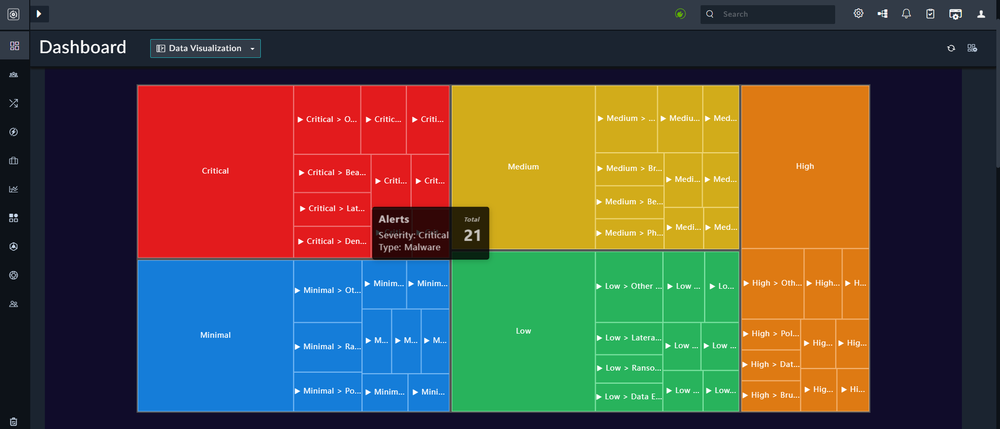
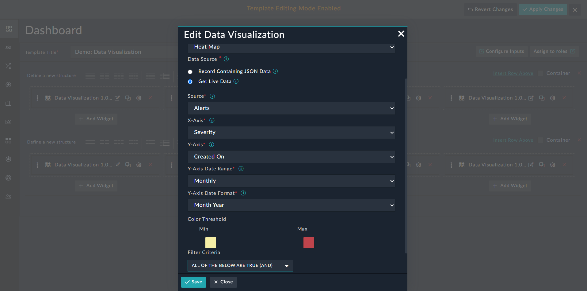
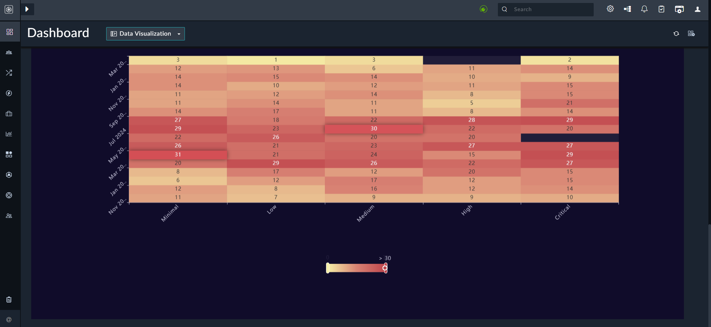
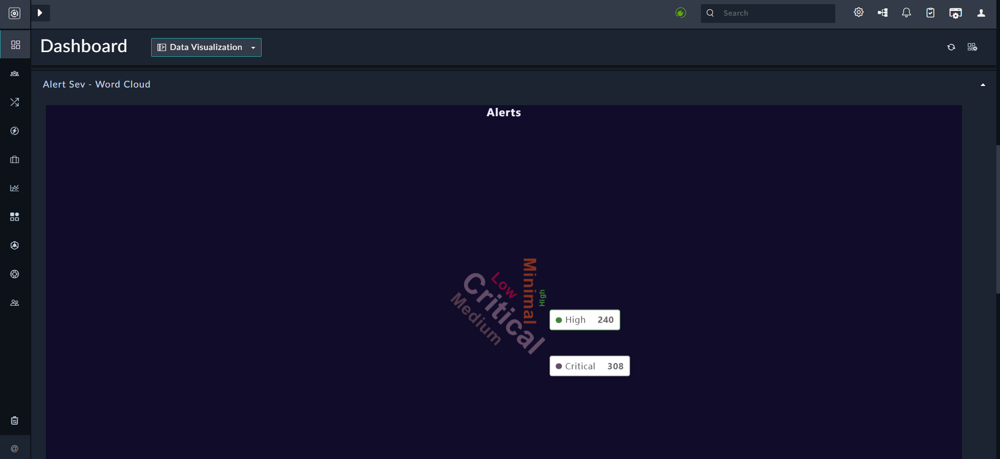

| [Home](../README.md) |
|----------------------|

# Usage

Data visualizations are sophisticated visual tools designed to represent complex datasets in an intuitive and insightful way. These charts integrate interactivity, multi-dimensional analysis, and advanced statistical visualizations.

## Sunburst

A Sunburst chart displays hierarchical data in a circular format, with concentric rings representing different levels of the hierarchy. For example, **_Alerts_** data can have **_Severity_** as its ***root*** category (center) and **_Type_** and **_Status_** as subsequent categories (outer rings).

### Using Static Data for Sunburst Visualization 

The **Record containing JSON Data** option retrieves and displays data stored in the  `JSON` format from a specific field of a module. You can also filter data that meets specific conditions.

For example, a Sunburst chart can visualize **_Alerts_** data, with **_Severity_** as its ***root*** category (center) and **_Type_** and **_Status_** as subsequent categories (outer rings).

#### Configuring the Sunburst chart with Static Data  <a name="configureStaticData"></a>

1. Edit a *Dashboard*, or a *Report* and click **Add Widget**.

    

2. Select **Data Visualization** from the list to open the **Data Visualization** widget's customization modal.

3. From the **Visualization Type** drop-down list, select **Sunburst**.

    

4. In the **Title** field, specify the title of the graphical representation. 

5. From the **Data Source** field, select the **Record Containing JSON Data** option.

6. From the **Source** drop-down list, select the module containing the  `JSON` data. For our example, we have selected the '`Key Store`' module. 

7. From the **Select JSON Field** drop-down list, select the field to display, which will list **_only_** fields of type `JSON`. For our example, select a relevant field within the '`Key Store`' module.

    A sample of a `JSON` type field is given [here](#sampleJson).

8. In the **Filter Criteria** field, define the keys for filtering and retrieving the relevant data. For our example, we want to display 'Alert Data' and therefore, `Key Equals Alert_Static_Data` is added as the filter condition.  

      

> [!NOTE]  
> Ensure that the filter conditions select **_only_** records containing relevant JSON data.

9. Click **Save** to save the configuration.

> [!TIP]  
> Follow the same procedure for configuring other charts using static data.
### Using Live Data for Sunburst Visualization

The **Get Live Data** option helps visualize hierarchical data as per current data. For example, it enables you to view alert data grouped by severity, type, and status in a hierarchical format.

#### Configuring the Sunburst chart with Live Data <a name="configureLiveDataSunburst"></a>

1. Edit a *Dashboard*, or a *Report* and click **Add Widget**.
2. Select **Data Visualization** from the list to open the **Data Visualization** widget's customization modal.
3. From the **Visualization Type** drop-down list, select **Sunburst**.
4. In the **Title** field, specify the title of the graphical representation. 
5. From the **Data Source** field, select the **Get Live Data** option.
6. From the **Source** drop-down list, select the module, whose data is to be represented hierarchically in the Sunburst chart. For our example, select **Alerts**.
7. From the **Level 1** drop-down list, select the picklist to group records in the selected module. The picklist selected in **Level 1** is the **_root_** category of the hierarchical dataset appearing in the center of the circle and is used to drill-down to other hierarchical levels. For example, **_Severity_**. Successive levels represent subcategories, forming the outer circles.
8. From the **Level 2** drop-down list, select the picklist that will be the **_second_** level of the hierarchical dataset, and appear at the second level in the circle.  For example, **_Type_**.
9. From the **Level 3** drop-down list, select the picklist that will be the **_third_** level of the hierarchical dataset, and appear at the outer-most level in the circle.  For example, **_Status_**.
10. (Optional) In the **Filter Criteria** field, conditions (key) to filter data, ensuring only relevant records are retrieved for the visualization. For example, use `Status Not Equals Closed`to exclude closed alerts.  
  To learn more about using filter criteria, refer to the [Nested Filter](https://docs.fortinet.com/document/fortisoar/7.6.2/user-guide/207943/dashboards-templates-and-widgets#Nested-Filters) section of the FortiSOAR™ User Guide.  
      
11. Click **Save** to save the configuration.


### Visualizing Alert Data in a Sunburst Chart

The following image illustrates a **Sunburst** chart visualizing Alert data grouped hierarchically with **_Severity_** appearing as the center of the circle, **_Type_** as the second circle and **_Status_** as the outermost circle:



## Tree Map

The Tree Map chart visualizes hierarchical data using rectangles. Each rectangle represents a category, with subcategories nested within their parent categories. The size and position of each rectangle represent the hierarchy. 

For example, a Tree Map can visualize **_Alerts_** data with **_Severity_** as its ***root*** category (parent rectangle), and **_Type_** and **_Status_** as subsequent categories (nested rectangles).

### Using Static Data for Tree Map Visualization

The **Record containing JSON Data** option retrieves and displays data stored in the  `JSON` format from a specific field of a module. You can also filter data that meets specific conditions.

For example, displaying a Tree Map chart that visualizes **_Alerts_** data with **_Severity_** as its ***root*** category, i.e., the parent rectangle,  and **_Type_** and **_Status_** as subsequent nested rectangles.

> [!NOTE]  
> The procedure for configuring Tree Map with static data is the same as for the Sunburst chart as described in the [Configuring the Sunburst chart with Static Data](#configureStaticData) section.

### Using Live Data for Tree Map Visualization

The **Get Live Data** option visualizes hierarchical data based on current records. For example, it enables you to view alert data grouped by severity, type, and status in a hierarchical format.

#### Configuring the Tree Map chart with Live Data

The procedure for configuring Tree Map with live data is same as for the Sunburst chart as described in the [Configuring the Sunburst Chart with Live Data](#configureLiveDataSunburst) section. Note that in a Tree Map, the levels are represented by rectangles. The picklist selected to group alert data at Level 1 will form the parent rectangle, with each successive level representing subcategories as nested rectangles. For our example,  **_Severity_** is at level 1 (parent rectangle), **_Type_** is at level 2 (nested within parent rectangle), and **_Status_** is at level 3 (nested within level 2). 

### Visualizing Alert Data in a Tree Map Chart

The following image illustrates a **Tree Map** chart visualizing Alert data grouped hierarchically with **_Severity_** appearing as parent/root rectangle, **_Type_** as the second rectangle (nested inside Severity) and **_Status_** as the inner-most nested rectangle:



#### Sample JSON type field for Sunburst and Tree Map charts <a name="sampleJson"></a>

Following is a sample of a field that contains data in the `JSON` format, which can be rendered in the Sunburst or Tree Map charts:

```JSON
{
  "High": {
    "$count": 17,
    "Phishing": {
      "Open": {
        "$count": 1
      },
      "$count": 3,
      "Closed": {
        "$count": 1
      },
      "Investigating": {
        "$count": 1
      }
    },
    "Beaconing": {
      "Open": {
        "$count": 3
      },
      "$count": 5,
      "Closed": {
        "$count": 1
      },
      "Investigating": {
        "$count": 1
      }
    },
    "Denial of Service": {
      "Open": {
        "$count": 3
      },
      "$count": 9,
      "Closed": {
        "$count": 1
      },
      "Investigating": {
        "$count": 5
      }
    }
  },
  "Medium": {
    "$count": 14,
    "Phishing": {
      "Open": {
        "$count": 2
      },
      "$count": 6,
      "Closed": {
        "$count": 2
      },
      "Investigating": {
        "$count": 2
      }
    },
    "Beaconing": {
      "Open": {
        "$count": 2
      },
      "$count": 3,
      "Investigating": {
        "$count": 1
      }
    },
    "Denial of Service": {
      "Open": {
        "$count": 4
      },
      "$count": 5,
      "Investigating": {
        "$count": 1
      }
    }
  },
  "Critical": {
    "$count": 20,
    "Phishing": {
      "Open": {
        "$count": 3
      },
      "$count": 6,
      "Closed": {
        "$count": 1
      },
      "Investigating": {
        "$count": 2
      }
    },
    "Beaconing": {
      "Open": {
        "$count": 5
      },
      "$count": 9,
      "Investigating": {
        "$count": 4
      }
    },
    "Denial of Service": {
      "Open": {
        "$count": 2
      },
      "$count": 5,
      "Closed": {
        "$count": 2
      },
      "Investigating": {
        "$count": 1
      }
    }
  }
}
```

## Heat Map

A Heat Map chart visualizes data in a matrix, where individual values represented by a gradient of colors. For example, **_Alerts_** data can be displayed on a grid with **_Severity_** on the horizontal axis and **_Created On_** on the vertical axis, along with the date range and format for the alerts. The Heat Map will display Alerts within the specified date range, with cooler tones indicating lower severity and warmer tones indicating higher severity.

### Using Static Data for Heat Map Visualization

The **Record containing JSON Data** option retrieves and displays data stored in the  `JSON` format from a specific field of a module. You can also filter data that meets specific conditions. 

> [!NOTE]  
> The procedure for configuring Tree Map with static data is the same as for the Sunburst chart as described in the  [Configuring the Sunburst chart with Static Data](#configureStaticData) section.

A sample of a `JSON` type field is given [here](#sampleJsonHeatMap).

### Using Live Data for Heat Map Visualization

The **Get Live Data** option visualizes data in a matrix based on real-time information. For example, viewing the alert data grouped in a matrix by Severity and Created On.

#### Configuring the Heat Map Chart with Live Data 

1. Edit a *Dashboard*, or a *Report* and click **Add Widget**.
2. Select **Data Visualization** from the list to open the **Data Visualization** widget's customization modal.
3. From the **Visualization Type** drop-down list, select **Heat Map**.
4. In the **Title** field, specify the title of the graphical representation. 
5. From the **Data Source** field, select the **Get Live Data** option.
6. From the **Source** drop-down list, select the module, whose data is to be represented as a grid in the Heat Map chart. For our example, select **Alerts**.
7. From the **X-Axis** drop-down list, select the field to be used as a category on the horizontal axis of the chart. For example, **_Severity_**. 
8. From the **Y-Axis** drop-down list, select the field to be used as a category on the vertical axis of the chart. For example, **_Created On_**.  
   If you select a DateTime field, from the **Y-Axis** drop-down list (such as selected in our example, i.e., the **_Created On_** field) then you must configure the following additional options:
    1. **Y-Axis Date Range**: Select the date range for which you want to populate the data. Choose between **Monthly** or **Daily**.
    2. **Y-Axis Date Format**: Select the date format to display the data. Choose between **Month Year** or **Month Day**.
9. (Optional) In the **Filter Criteria** field, conditions (key) to filter data, ensuring only relevant records are retrieved for the visualization.  
   To learn more about using filter criteria, refer to the [Nested Filter](https://docs.fortinet.com/document/fortisoar/7.6.2/user-guide/207943/dashboards-templates-and-widgets#Nested-Filters) section of the FortiSOAR™ User Guide.  
       
10. Click **Save** to save the configuration.

### Visualizing Alert Data in a Heat Map Chart

The following image illustrates a **Heat Map** chart that visualizes Alert data in a grid. **_Severity_** is displayed along the horizontal axis, while **_Created On_** is shown on the vertical axis, based on the configured date range and format. The Heat Map uses cooler tones to represent lower severities, such as 'Minimal' and 'Low,' and warmer tones to represent higher severities, such as 'High' and 'Critical':

 

#### Sample JSON type field for Heat Map chart <a name="sampleJsonHeatMap"></a>

Following is a sample of a field that contains data in the `JSON` format, which can be rendered in the Heat Map chart:

```JSON
{
  "data": [
    [
      0,
      0,
      11
    ],
    [
      0,
      1,
      14
    ],
    [
      0,
      2,
      14
    ],
    [
      1,
      0,
      13
    ],
    [
      1,
      1,
      17
    ],
    [
      1,
      2,
      5
    ],
    [
      2,
      0,
      15
    ],
    [
      2,
      1,
      22
    ],
    [
      2,
      2,
      11
    ],
    [
      3,
      0,
      13
    ],
    [
      3,
      1,
      12
    ],
    [
      3,
      2,
      6
    ],
    [
      4,
      0,
      10
    ],
    [
      4,
      1,
      18
    ],
    [
      4,
      2,
      3
    ]
  ],
  "xAxis": [
    "Minimal",
    "Low",
    "Medium",
    "High",
    "Critical"
  ],
  "yAxis": [
    "Jan 2025",
    "Feb 2025",
    "Mar 2025"
  ],
  "moduleName": "Alerts"
}
```
## Word Cloud

The Word Cloud visualizes text data with the size and color of each word represents its frequency. For example, **_Alerts_** data can be displayed with **_Severity_** as the source, where the size of each severity corresponds to the number of alerts.

### Using Static Data for Word Cloud Visualization

The **Record containing JSON Data** option retrieves and displays data stored in the  `JSON` format from a specific field of a module. You can also filter data that meets specific conditions. 

> [!NOTE]  
> The procedure for configuring Word Cloud with static data is the same as for the Sunburst chart as described in the  [Configuring the Sunburst chart with Static Data](#configureStaticData) section.

A sample of a `JSON` type field is given [here](#sampleJsonWordCloud).

### Using Live Data for Word Cloud Visualization

The **Get Live Data** option visualizes text data of the selected module based on current records. For example, viewing alerts based on their severity.

#### Configuring the Word Cloud chart using live data

1. Edit a *Dashboard*, or a *Report* and click **Add Widget**.

2. Select **Data Visualization** from the list to open the **Data Visualization** widget's customization modal.

3. From the **Visualization Type** drop-down list, select **Word Cloud**.

4. In the **Title** field, specify the title of the graphical representation. 

5. From the **Data Source** field, select the **Get Live Data** option.

6. From the **Source** drop-down list, select the module, whose text data is to be visualized in the Word Cloud chart. For our example, select **Alerts**.

7. From the **Word Source** drop-down list, select the picklist to group records in the selected module. For example, **_Severity_**. 

8. (Optional) In the **Filter Criteria** field,conditions (key) to filter data, ensuring only relevant records are retrieved for the visualization.  
   To learn more about using the filter criteria, refer to the [Nested Filter](https://docs.fortinet.com/document/fortisoar/7.6.2/user-guide/207943/dashboards-templates-and-widgets#Nested-Filters) section of the FortiSOAR™ User Guide.  
       

9. Click **Save** to save the configuration.

### Visualizing Alert Data in a Word Cloud Chart

The following image illustrates a **Word Cloud** chart based ***Alert Severity***, where the size of each word (severity) represents the frequency of alerts for each severity level. For example, if the majority of alerts are of  'Critical' severity, it will appear larger than 'High', which may have fewer alerts:



#### Sample JSON type field for Word Cloud chart <a name="sampleJsonWordCloud"></a>

Following is a sample of a field that contains data in the `JSON` format, which can be rendered in the Word Cloud chart:

```JSON
[
  {
    "name": "Medium",
    "value": 270,
    "display": ""
  },
  {
    "name": "High",
    "value": 240,
    "display": ""
  },
  {
    "name": "Low",
    "value": 264,
    "display": ""
  },
  {
    "name": "Minimal",
    "value": 271,
    "display": ""
  },
  {
    "name": "Critical",
    "value": 308,
    "display": ""
  }
]
```

## Next Steps

| [Installation](./setup.md#installation) | [Configuration](./setup.md#configuration) |
| --------------------------------------- | ---------------------------------------- |
